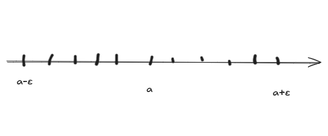

数列的极限
=====================

什么是数列？

   数列就是按照一定的法则，按顺序排列的一组数字

   如果按照一定的法则，对每个 :math:`n\in N_+` ,对应着一个确定的实数 :math:`x_n` 这些实数 :math:`x_n` 按照下标n从小到大排列得到的一个序列。 

数列中的每一个数叫做数列的项,第n项 :math:`x_n` 叫做数列的一般项(或通项)

数列极限的定义
--------------------------

给定一个数列

.. math::

   x_n=\frac{n+(-1)^{n-1}}{n}=1+(-1)^{n-1}\frac{1}{n}

   \\x_n=1+(-1)^{n-1}\frac{1}{n}

   \\x_n-1=(-1)^{n-1}\frac{1}{n}

两个数a和b之间的接近程度可以用这两个数之差的绝对值|b-a| 来度量(在数轴上|b-a|表示点a与点b之间的距离),|b-a|的值越小,a与b就越近

给数列 :math:`x_n-1=(-1)^{n-1}\frac{1}{n}` 加上绝对值这后就是这样的 :math:`|x_n-1|=|(-1)^{n-1}|\frac{1}{n}` 也就是 :math:`|x_n-1|=\frac{1}{n}` 因为加了绝对值前面的 :math:`|(-1)^{n-1}|` 恒为1 又由于n是一个正整数，所以 :math:`\frac{1}{n}` 等于他本身 所以得到 :math:`|x_n-1|=\frac{1}{n}`

当n越来越大时 :math:`\frac{1}{n}` 越来越小 从而 :math:`x_n` 就越来越接近于1,应为只要n足够大 :math:`|x_n-1|` 即 :math:`\frac{1}{n}`  可以小于任意给定的正数，所以说，当n无限增大时， :math:`x_n` 无限接近于1

例如给定 :math:`\frac{1}{100}` 当n > 100 时，即从101项起(也就是101项以后的的所有项),都能使不等式 :math:`|x_n-1| < \frac{1}{100}` 成立。同样的给定 :math:`\frac{1}{1000}` 只要n > 1000，从1001项起，都使不等式 :math:`|x_n-1| < \frac{1}{1000}` 成立

.. important:: 总结 & 定义

   一般的，不论给定的正数 :math:`\varepsilon` 多么小，总存在一个正整数N，使得当n > N 时，不等式 :math:`|x_n-1| < \varepsilon` 成立。这样的一个数1 就叫做数列 :math:`x_n=\frac{n+(-1)^{n-1}}{n}` 的极限

   **定义**  设 :math:`{x_n}` 为一个数列，如果存在常数a,对任意给定的正数 :math:`\varepsilon` (不论它多么的小)，总存在正整数N，使得当n > N时，不等式 :math:`|x_n-a| < \varepsilon` 都成立，那么就称常数a是数列 :math:`{x_n}` 的极限，或者称数列 :math:`{x_n}` 收敛于 a ,记为 
   
   .. math::

      \lim_{n\rightarrow \infty}{x_n}=a \quad 或 \quad x_n \rightarrow a (n \rightarrow \infty)

如果不存在这样的常数a,那就说这个数列 :math:`{x_n}` 没有极限或者说数列 :math:`{x_n}` 是 **发散** 的，习惯上也说 :math:`\lim_{n\rightarrow \infty}{x_n}` 不存在

.. note::
   
   正整数 :math:`\varepsilon` 可以是任意给定的这很重要，因为只有这样，不等式 :math:`|x_n-a| < \varepsilon` 才能表达出 :math:`x_n` 与 a **无限接近** 的意思，在定义中正整数N是与任意给定的正数 :math:`\varepsilon` 有关的，  它随着 :math:`\varepsilon` 的给定而选定

因不等式  :math:`|x_n-a| < \varepsilon` 与不等式 :math:`a-\varepsilon < x_n < a+\varepsilon` 

 :math:`|x_n-a| < \varepsilon` 表示： :math:`x_n` 距离a小于 :math:`\varepsilon` ，也就是「在 a 的 ε 邻域内」

 :math:`|x_n-a| < \varepsilon` 

 :math:`\Leftrightarrow -\varepsilon <x_n-a <\varepsilon` 

 :math:`\Leftrightarrow a-\varepsilon < x_n <a+\varepsilon`  

 所以当n > N时，所有的点 :math:`x_n` 都落在开区间 :math:`(a-\varepsilon,a+\varepsilon)` 内，而只有有限个(至多只有N个)在这个区间之外

 如果这一块看起来有点懵可以先看下 :ref:`eps-note`

收敛数列的性质
-------------------------

**定理1 极限的唯一性**

   如果数列 :math:`\{x_n\}` 收敛，那么它的极限唯一

**定理2收敛数列的有界性**
   
   如果数 :math:`\{x_n\}` 列收敛，那么数列 :math:`\{x_n\}` ，一定有界.

**定理3 收敛数列的保号性**

   如果 :math:`\lim_{n\rightarrow \infty}x_n=a` ,且a>0(或者a<0),那么存在正整数N,当n>N时,都有 :math:`x_n>0(或x_n<0)`  

**推论**

   如果数列 :math:`{x_n}` 从某项起有 :math:`x_n\geq 0(或 x_n \leq 0),且\lim_{n\rightarrow \infty}x_n=a` ,那么 :math:`a\geq 0` 或 :math:`a\leq 0`

**定理4 收敛数列与其子数列间的关系**

   如果数列 :math:`\{x_n\}` 收敛于a,那么它的任一子数列也收敛,且极限也是a. 

.. _eps-note:

关于绝对值的知识
^^^^^^^^^^^^^^^^

.. note:: 绝对值的一些知识

   绝对值=到0点的距离

   它的作用是：无论是x是正数还是负数，结果都是非负的

   .. image:: ../images/shuzhou.png
      :alt: 数轴图
      :width: 400px
      :align: center

   例1：x = 3，离 0 的距离是 3， :math:`|3| = 3` 

   例2：x = -2，离 0 的距离也是 2， :math:`|-2| = 2` 

   而 :math:`|x| < 2 \Leftrightarrow -2 <x <2` ， :math:`|x|<2` 表示的是：数轴上，点 x 到原点 0 的距离 小于 2。,在去掉绝对值之后为什么要加上一个 -2 ，那是因为-2到0的距离和2到0的距离是一样的

   **绝对值 = 数轴上的距离，是没有方向的“长度”概念。**

