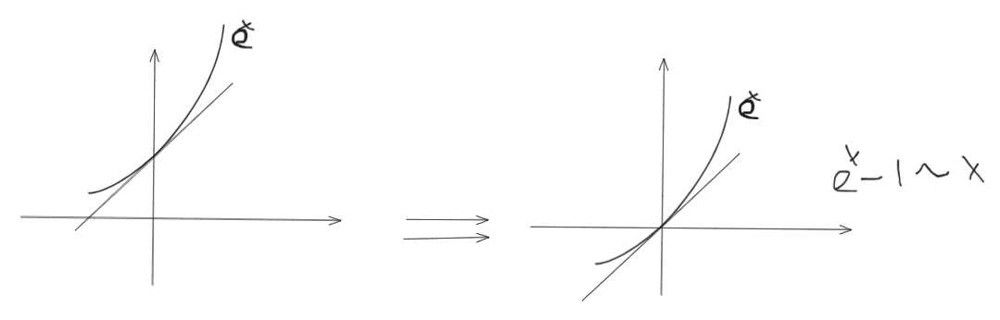

无穷小的比较
===========================

定义1 （无穷小量）

    若 :math:`\lim_{x\rightarrow x_0}{f(x)}=0` ,则称f(x)为当 :math:`x\rightarrow x_0`  时的无穷小量

定义2 (无穷小的比较)

(1) 若 :math:`\lim{\frac{\beta}{\alpha}}=0` ,那么就说 :math:`\beta` 是比 :math:`\alpha`  高阶的无穷小，记为 :math:`\beta=o(\alpha)`  

(2) 若 :math:`\lim{\frac{\beta}{\alpha}}=\infty` ,那么就说 :math:`\beta` 是比 :math:`\alpha`  低阶的无穷小
 
(3) 若 :math:`\lim{\frac{\beta}{\alpha}}=c\neq 0` , 那么就说 :math:`\beta` 与 :math:`\alpha`  是同阶无穷小

(4) 若 :math:`\lim{\frac{\beta}{{\alpha}^k}}=c\neq 0 ,k > 0` , 那么就说 :math:`\beta` 是关于 :math:`\alpha`  的k阶无穷小
 
(5) 若 :math:`\lim{\frac{\beta}{\alpha}}=1` ,那么就说 :math:`\beta` 与 :math:`\alpha`  是等价无穷小，记作 :math:`\beta` ~ :math:`\alpha` 

定理1 

    :math:`\beta 与 \alpha` 是等价的充分必要条件是 :math:`\beta=\alpha +o(\alpha)`  

定理2

    .. math::

        \alpha \sim \widetilde{\alpha} 的意思是: \lim{\frac{\alpha}{\widetilde{\alpha}}}=1

        \\

        \alpha \sim \widetilde{\alpha}, \beta \sim \widetilde{\beta},且 \lim{\frac{\widetilde{\beta}}{\widetilde{\alpha}}},则

        \\
        \lim{\frac{\beta}{\alpha}}=\lim{\frac{\widetilde{\beta}}{\widetilde{\alpha}}}

常见初等函数的等价无穷小(当 :math:`x \rightarrow 0` )
-----------------------------------------------------------

======================================  ============================  ========================
     表达式                              等价无穷小形式                   备注
======================================  ============================  ========================
:math:`\sin{x}`                         :math:`x`                     :math:`\sin{x}  \sim x`  
:math:`\tan{x}`                         :math:`x`                     :math:`\tan{x} \sim x`  
:math:`\arcsin{x}`                      :math:`x`                     :math:`\arcsin{x} \sim x`  
:math:`\arctan{x}`                      :math:`x`                     :math:`\arctan{x} \sim x`  
:math:`\ln{1 + x}`                      :math:`x`                     :math:`\ln{1 + x} \sim x`  
:math:`e^x - 1`                         :math:`x`                     :math:`e^x - 1 \sim x`  
:math:`1 - \cos{x}`                     :math:`(\frac{1}{2})x^2`      :math:`1 - \cos{x}  \sim (\frac{1}{2})x^2`  
:math:`\sqrt{1 + x}`                    :math:`\frac{1}{2}x`          :math:`\sqrt{1 + x} - 1 \sim (\frac{1}{2})x`  
:math:`a^x - 1`                         :math:`x\ln{a}`               :math:`a^x - 1 \sim x\ln{a}`  
:math:`(1 + x)^r - 1`                   :math:`rx`                    :math:`r ∈ R, x \rightarrow 0`  
:math:`\ln{1 + x} - x`                  :math:`(\frac{1}{2})x^2`      二阶无穷小
:math:`\tan{x} - x`                     :math:`(\frac{1}{3})x^3`      三阶无穷小
:math:`\sin{x} - x`                     :math:`(\frac{1}{6})x^3`      三阶无穷小
:math:`e^x - 1 - x`                     :math:`(\frac{1}{2})x^2`      二阶无穷小
======================================  ============================  ========================

泰勒公式
---------------------

函数逼近

构造与 :math:`e^x` 函数一样的函数一样的函数

:math:`e^x-1 \sim x` 跟x在0点处有相等的函数值和导数值

函数值一样，导数值一样，为什么还是不一样？

从图像中可以看出，斜率的变化不不一样(变化趋势不一样),什么是斜率？一阶导是斜率，一阶导的变化趋势是谁？二阶导！延续这个想法，三阶、四阶.... 全部都一样。

导数是局部的性质，改点的导数只和这个领域有关

幂函数，在0点处的某阶导，只和一项有关。这一项的次数等于求导阶数

.. note:: 举例
   
    例1: 

    :math:`f(x)=3x+4x^2+2x^3+7x^4+6x^5` 在0点的三阶导 :math:`f'''(0)` 只和 :math:`bx^3` 有关

    :math:`f(x)=3x+4x^2+2x^3+7x^4+6x^5` 

    :math:`f'(0)=3+2\cdot 4x+2\cdot3x^2+7\cdot 4x^3+6\cdot 5x^4` 

    :math:`f''(0)=2\cdot 4\cdot 1+2\cdot 3\cdot 2x+7\cdot 4\cdot 3x^2+6\cdot 5\cdot 4 x^3`

    :math:`f''(0)=2\cdot 3\cdot 2\cdot 1+7\cdot 4\cdot 3\cdot 2x+6\cdot 5\cdot 4\cdot3 x^2` 

    通过计算可以知道，:math:`f'''(0)` 只和 :math:`bx^3` 有关，因为在 :math:`bx^3` 前面的项会在求导的过程中“导没”，:math:`bx^3` 后面的项会在0这个点的代入计算时，“代没”，也就是都没了只剩下 :math:`bx^3` 

1) 等价只是“半成品” ，从图像来看就知道两个函数还是不一样的所以较等价，不是等于，等价是次数小的项把次数大的项给吸收了，次数小的项趋向于0的速度没有次数大的项快，也就是所次数小的项比次数大的项更大，吸收律
2) 为了构造出与 :math:`e^x` 相等的函数根据例1 :math:`e^x=a+bx+cx^2+dx^3+.... 其中a 是 e^x 在0点的函数值，bx是一阶导，cx^2是二阶导，dx^3` 是三阶导，以此类推

开始构造

需要在0点的时候 :math:`e^x` 的函数值是1 那么 a=1， :math:`e^x` 在0点处每一阶导都是1

也就是 :math:`e^x=1+1\cdot x+ \frac{x^2}{2!}+\frac{x^3}{3!}+....`  

再加上一个条件 :math:`x\rightarrow 0` 右边都是 :math:`x^3` 的高次项，把后面所有的的项都写为 :math:`o(x^3)` 

就变为了 :math:`e^x=1+1\cdot x+ \frac{x^2}{2!}+\frac{x^3}{3!}+o(x^3)`  也就是佩亚诺余项

底层逻辑：右边这个函数在0点处跟 :math:`e^x` 处处相等

根据例1，如果是 :math:`f'''(x)` 还只是和 :math:`bx^3` 有关吗？显然不是！在可以导没，但是右边就不可以代没了。

.. note:: 例2

    :math:`f(x)=a_0+ax+bx^2+cx^3+dx^4` 在研究 :math:`x\rightarrow 0` 时可以，在 :math:`x\rightarrow 1` 时不行

    那么就应该重新构建一个函数

    :math:`f(x)=a_0+a(x-1)+b(x-1)^2+c(x-1)^3+d(x-1)^4+...` 这样就ok了

因此由例2我们可以得出，当我们计算 :math:`x\rightarrow x_0` 的时候就可以有

    :math:`f(x)=a+b(x-x_0)+c(x-x_0)^2+d(x-x_0)^3+...` 

    而，由于

    :math:`f(x_0)=a, f'(x_0)=b, f''(x_0)=c\cdot 2!, f'''(x_0)=d\cdot 3!` 这个代入到上一个式子

    得，
    :math:`f(x)=f(x_0)+f'(x_0)(x-x_0)+\frac{f''(x_0)}{2!}(x-x_0)^2+\frac{f'''(x_0)}{3!}(x-x_0)^3+...` 

    所以就得到了这个书本上的泰勒公式

常用函数的麦克劳林展开
-----------------------------

以下是常用初等函数在 x = 0 处的泰勒展开（即麦克劳林公式），适用于极限计算、近似计算、微积分证明等：

.. list-table:: 常用函数的麦克劳林展开 :math:`(x \rightarrow 0)`
   :widths: 25 60 25
   :header-rows: 1

   * - 函数 f(x)
     - 麦克劳林展开式
     - 收敛区间
   * - :math:`e^x`  
     - :math:`1 + x + \frac{x^2}{2!} + \frac{x^3}{3!} + \cdots+\frac{x^n}{n!}+o(x^n)`  
     - :math:`(-\infty, +\infty)`  
   * - :math:`\ln(1+x)`  
     - :math:`x - \frac{x^2}{2} + \frac{x^3}{3} - \frac{x^4}{4}+o(x^4)`  
     - :math:`(-1, 1]`  
   * - :math:`\frac{1}{1 - x}`  
     - :math:`1 + x + x^2 + x^3 + \cdots`  
     - :math:`|x| < 1`  
   * - :math:`\frac{1}{1 + x}`  
     - :math:`1 - x + x^2 - x^3 + \cdots`  
     - :math:`|x| < 1`  
   * - :math:`\sin x`  
     - :math:`x - \frac{x^3}{3!} + \frac{x^5}{5!} - \frac{x^7}{7!} + \cdots`  
     - :math:`(-\infty, +\infty)`
   * - :math:`\cos x`  
     - :math:`1 - \frac{x^2}{2!} + \frac{x^4}{4!} - \frac{x^6}{6!} + \cdots`  
     - :math:`(-\infty, +\infty)`  
   * - :math:`\tan x`  
     - :math:`x + \frac{x^3}{3} + \frac{2x^5}{15} + \cdots`  
     - :math:`\left(-\frac{\pi}{2}, \frac{\pi}{2}\right)`
   * - :math:`\arcsin x`  
     - :math:`x + \frac{x^3}{6} + \frac{3x^5}{40} + \cdots`  
     - :math:`|x| \leq 1`  
   * - :math:`\arctan x`  
     - :math:`x - \frac{x^3}{3} + \frac{x^5}{5} - \cdots`  
     - :math:`|x| \leq 1`  
   * - :math:`(1 + x)^a`  
     - :math:`1 + ax + \frac{a(a-1)}{2!}x^2 + \frac{a(a-1)(a-2)}{3!}x^3 + \cdots`  
     - :math:`|x| < 1`
   * - :math:`ln(x+\sqrt{x^2+1})`  
     - :math:`x- \frac{1}{6}x^3 +\frac{3}{40}x^5 - \frac{5}{112}x^7 + \cdots`  
     - :math:`|x| \leq 1`

.. tip:: 记忆技巧 & 如何食用

    记忆技巧：
    
    :math:`e^x`  ：全部为正，分母是阶乘

    :math:`\sin x`  ：奇数次幂、正负交替

    :math:`\cos x`  ：偶数次幂、正负交替

    :math:`\ln(1+x)`  ：交替项，分母是自然数

    :math:`\arctan x`  ：奇次幂，正负交替

    :math:`(1+x)^a`  ：二项展开的一般形式

    使用方法：
    
    取前几项作为近似值；高阶项可视为 :math:`o(x^n)`   无穷小，常用于极限计算。

    在计算中，幂函数留下，不是幂函数展开成幂函数

    到底精确到几次方？
    
    :math:`\frac{A}{B}` 型 看分母几次，就展开到几次

    :math:`A-B` 型 最低次幂消不掉为止
