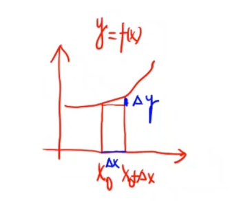

函数的连续性和间断点
=============================

定义(连续)
------------------
    若 :math:`\lim_{\Delta \rightarrow 0}\Delta y=0` 或 :math:`\lim_{x \rightarrow x_0}f(x)=f(x_0)`
    
    这点的极限存在,并且等于这点的函数值,就称函数在这点是连续的

**左连续**

    :math:`\lim_{x \rightarrow x_0^-}f(x)=f(x_0)`

**右连续**

    :math:`\lim_{x \rightarrow x_0^+}f(x)=f(x_0)`

.. attention::
    
    连续 :math:`\Leftrightarrow` 左连续且右连续

f(x)在区间上连续
    对于开区间(a,b)要求在这个区间内所有的点都连续

    对于开闭区间[a,b]要求在这个区间内,内部的点都连续,而对于左端点要求右连续,右端点要求左连续

和差化积公式

    :math:`\sin{A} + \sin{B} = 2\sin({\frac{A+B}{2})\cos({\frac{A-B}{2}}})`

    :math:`\sin{A}-\sin{B}=2\cos({\frac{A+B}{2}})\sin({\frac{A-B}{2}})`  

.. admonition:: 例子

    试证: :math:`\sin{x}` 在区间 ( :math:`-\infty, +\infty` )上连续  

    根据上述定理,只要证明在这个区间的每一点都连续

    [证] :math:`\lim_{x \rightarrow x_0}{\sin{x}}=\sin{x_0}, \forall x_0 \in R` 

    :math:`\lim_{x\rightarrow 0}{\frac{\sin{x}}{x}}=1`   

    设 :math:`x \rightarrow x_0` ,我们令 :math:`h=x-x_0` ,即 :math:`x=x_0+h` ,当 :math:`x\rightarrow x_0` 时 :math:`h \rightarrow 0`    

    :math:`\lim_{x\rightarrow x_0}{\sin{x}}=\lim_{x\rightarrow 0}sin{(x_0+h)}` ,用和角公式展开

    :math:`\sin{(x_0+h)}=\sin{x_0}\cos{h}+\cos{x_0}\sin{h}` ,所以有

    :math:`\lim_{h\rightarrow 0}{\sin{(x_0+h)}}=\lim_{h\rightarrow 0}(\sin{x_0}\cos{h}+\cos{x_0}\sin{h})` 

    :math:`\lim_{h\rightarrow 0}\cos{h}=1`

    :math:`\lim_{h\rightarrow 0}\sin{h}=0` , 代入

    :math:`\lim_{x\rightarrow x_0}{\sin{x}}=\sin{x_0}\cdot 1+\cos{x}\cdot 0`

    :math:`\lim_{x\rightarrow x_0}{\sin{x}}=\sin{x_0}` ,得证

函数的间断点
-----------------------------

f(x)在 :math:`x_0` 处连续
    1) f(x) 在 :math:`x_0` 有定义 
    2) :math:`\lim_{x\rightarrow x_0}{f(x_0)}` 存在 
    3) :math:`\lim_{x\rightarrow x_0}{f(x_0)}=f(x_0)`

**函数在一点上连续有以上三个条件,如果这三个条件中有一点不成立则是间断点**
    1) f(x) 在 :math:`x_0` 无有定义 
    2) :math:`\lim_{x\rightarrow x_0}{f(x_0)}` 不存在 
    3) :math:`\lim_{x\rightarrow x_0}{f(x_0)}\neq f(x_0)`
 
间断点分类
^^^^^^^^^^^^^^
    第一类间断点:(左 右极限都存在)
        1) 可去间断点 :math:`f(x_0-0)=f(x_0+0)` 左右极限相等但是这一点没有定义
        2) 跳跃间断点 :math:`f(x_0-0) \neq f(x_0+0)` 左右极限不相等

    第二类间断点(左 右极限至少有一个不存在)
        1) 无穷间断点
        2) 震荡间断点