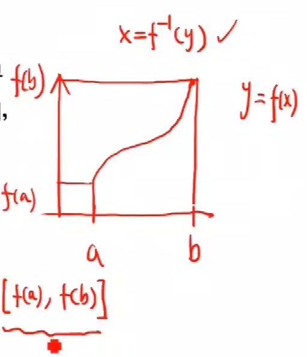

连续函数的运算与初等函数的连续性
==================================

初等函数的定义

    初等函数是由五类基本初等函数,经过有限次的加减乘除和复合得来,并且能够用一个解析式来表示

    要解决初等函数的连续性问题就得要解决三个问题
        1) 基本初等函数的连续性
        2) 和差积商 的连续性
        3) 复合函数连续性

.. image:: ../images/HSLX.png
   :alt: 函数极限图
   :width: 800px
   :align: center

指数函数和对数函数互为反函数,三角函数和反三角函数互为反函数,所以我们只要解决一个

然后三角函数中的 :math:`\tan{x}` 函数他是 :math:`\frac{\sin{x}}{\cos{x}}` 所以只要解决 :math:`\sin{x}` 和  :math:`\cos{x}` 的连续性, 再解决商的连续性就ok,而 :math:`\sin{x}` 和  :math:`\cos{x}` 之前已经证明过是连续函数,所以只需要知道商的连续性即可

幂函数可以写成 :math:`x^{\mu}=e^{\mu \ln{x}}` ,如果指数解决,对数解决,复合解决,那这个就解决了

连续函数的 和 差 积 商 的连续性
^^^^^^^^^^^^^^^^^^^^^^^^^^^^^^^^^^^
 

.. important:: 定理1

   设函数f,g在 :math:`x_0` 处连续, 则
        :math:`f\pm g, fg, \frac{f}{g} (g(x_0)\neq0)` 都在 :math:`x_0` 处连续   

.. admonition:: 例1
    
    证明: :math:`\tan{x}, \cot{x}` 在其定义域内是连续的

    由于 :math:`\sin{x} 和 \cos{x}`  是连续的, :math:`\tan{x}=\frac{\sin{x}}{\cos{x}}, \cot{x} = \frac{1}{\tan{x}} 也等价于 \cot{x} = \frac{\cos{x}}{\sin{x}}`   

    所以根据定理1可以知道 :math:`\tan{x}和 \cot{x}` 在定义域内是连续的 

反函数与符合函数的连续性
^^^^^^^^^^^^^^^^^^^^^^^^^^^^

.. important:: 定理二 (反函数的连续性)

   设 :math:`f:|a,b|\rightarrow R` 是严格单调递增(减)的连续函数.则其反函数在[f(a),f(b)],([f(b),f(a)]),上也是连续的 

上图中这个反函数 :math:`x=f^{-1}(y)` 应该是[f(a),f(b)]这个取值范围上的连续函数,从几何上直接看这是一个很明显的结论,这个就是函数与反函数的连续性

.. admonition:: 例2

    证明: :math:`\arcsin{x}, \arccos{x}, \arctan{x} \arccot{x}` 在其定义域内是连续的

    由上述理论可知, 这个反三角函数都是连续的 

.. important:: 定理三 (复合函数的连续性)

    设y-f(g(x))是由y=f(u)与 u=g(x) 复合而成,若g(x)在 :math:`x_0` 处连续,f(u)在 :math:`u_0` 连续, :math:`u_0=g(x_0)` ,则f(f(x)) 在 :math:`x_0` 处连续  

    也就是 :math:`\lim_{x\rightarrow x_0}{f(g(x))}=f(g(x0))` 

初等函数的连续性
^^^^^^^^^^^^^^^^^^^^^^^^^^^^^^

.. important:: 定理四

    基本初等函数(反对幂三指)在其 **定义域** 内都是连续的

.. important:: 定理五

    初等函数在其 **定义区间** 内是连续的

    函数的定义域是唯一的,定义区间不是唯一的,定义区间，包含在定义域内部的区间都叫定义区间